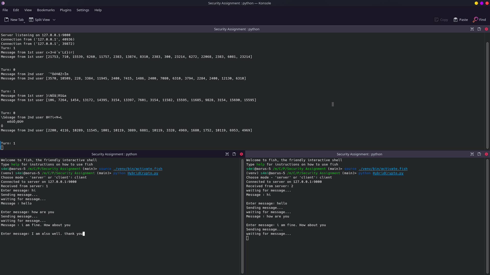

# Introduction To Computer Security and Forensics Lab

## Assignment 02

Submitted by:
Name: Rubayet Sadman Sami
Reg: 2019331063
Session: 2019-20

### Report of Task - 1

First test case IO is as follows:

```
Key:
In ASCII: Thats my Kung Fu
In HEX: 5468617473206d79204b756e67204675

Plain Text:
In ASCII: Two One Nine Two
In HEX: 54776f204f6e65204e696e652054776f

Cipher Text:
In ASCII: )ÃP_W ö@"™³×:
In HEX: 29c3505f571420f6402299b31a2d73a

Decipher Text:
In ASCII: Two One Nine Two
In HEX: 54776f204f6e65204e696e652054776f

Execution Time:
Key Scheduling: 0.01401519775390625
Encryption Time: 0.11635255813598633
Decryption Time: 0.19560480117797852
```

2nd test case IO is as follows:

```
Key:
In ASCII: SUST CSE19 Batch
In HEX: 53555354204353453139204261746368

Plain Text:
In ASCII: IsTheirCarnivalSuccessful
In HEX: 497354686569724361726e6976616c5375636365737366756c

Cipher Text:
In ASCII: }Ž ÄÍ´ÊBȍw3QeP"¦
Sã6‚Ðo
In HEX: 7d58e0c4cd1a1eb4ca42c88d771c111f3351655022a6ea53e33682d026f

Decipher Text:
In ASCII: IsTheirCarnivalSuccessful       
In HEX: 497354686569724361726e6976616c5375636365737366756c20202020202020

Execution Time:
Key Scheduling: 0.00019550323486328125
Encryption Time: 0.20501399040222168
Decryption Time: 0.3417835235595703
```

3rd test case IO is as follows:

```
Key:
In ASCII: SUST CSE19 Batch
In HEX: 53555354204353453139204261746368

Plain Text:
In ASCII: YesTheyHaveMadeItAtLast
In HEX: 59657354686579486176654d616465497441744c617374

Cipher Text:
In ASCII: TwX6ÁEq@YÖñWŽq›²ûî^½m:Ï
In HEX: 155415771458367c11457168f4059d618f1571f8e719bb2fbee5ebd6d3acf

Decipher Text:
In ASCII: YesTheyHaveMadeItAtLast         
In HEX: 59657354686579486176654d616465497441744c617374202020202020202020

Execution Time:
Key Scheduling: 0.0001876354217529297
Encryption Time: 0.22025656700134277
Decryption Time: 0.3270719051361084
```

4th case follows:

```
Key:
In ASCII: BUETCSEVSSUSTCSE
In HEX: 42554554435345565353555354435345

Plain Text:
In ASCII: BUETnightfallVsSUSTguessforce
In HEX: 425545546e6967687466616c6c5673535553546775657373666f726365

Cipher Text:
In ASCII: 6‘4¡¼é”­Ô̕DC͋˜ß2î¸~ø
In HEX: 368d9d9134a1bce994add4cc954443cd8beebfbd98df329dee10b817ecf8f

Decipher Text:
In ASCII: BUETnightfallVsSUSTguessforce   
In HEX: 425545546e6967687466616c6c5673535553546775657373666f726365202020

Execution Time:
Key Scheduling: 0.00024247169494628906
Encryption Time: 0.20470619201660156
Decryption Time: 0.32765769958496094
```

Issue faced during coding,
1. Got confused while coding the inverse mix column part.
2. Got confused with how will I store keys, words and states

### Report of Task - 2

1st test case IO 
```
Bit Size = 16

Public Key: (e, n) =  (527, 4033)
Private key: (d, n) = : (1055, 4033)

Plaintext: 
BUETCSEVSSUSTCSE
Encrypted Text(ASCII):
[2909, 3986, 3717, 322, 1175, 2254, 3717, 1746, 2254, 2254, 3986, 2254, 322, 1175, 2254, 3717]

Decrypted Text:
BUETCSEVSSUSTCSE


Execution Time:
Key Generation: 0.0003440380096435547
Encryption Time: 4.291534423828125e-05
Decryption Time: 2.9087066650390625e-05
```

2nd test case IO
```
Bit Size = 32

Public Key: (e, n) =  (661362203, 1222617811)
Private key: (d, n) = : (276789155, 1222617811)

Plaintext: 
BUETCSEVSSUSTCSE
Encrypted Text(ASCII):
[1006669828, 1134941113, 636962136, 976859257, 251596798, 645242163, 636962136, 45169067, 645242163, 645242163, 1134941113, 645242163, 976859257, 251596798, 645242163, 636962136]

Decrypted Text:
BUETCSEVSSUSTCSE


Execution Time:
Key Generation: 0.0005381107330322266
Encryption Time: 9.512901306152344e-05
Decryption Time: 0.00010657310485839844
```
3rd test case IO
```
Bit Size = 64

Public Key: (e, n) =  (577210878175704937, 3440039839532412931)
Private key: (d, n) = : (1383171026954337873, 3440039839532412931)

Plaintext: 
BUETCSEVSSUSTCSE
Encrypted Text(ASCII):
[528898924581693310, 3439943606802663675, 513050169706562721, 3153167833073225347, 1013841074878003830, 3413375785950765581, 513050169706562721, 2713352964945795925, 3413375785950765581, 3413375785950765581, 3439943606802663675, 3413375785950765581, 3153167833073225347, 1013841074878003830, 3413375785950765581, 513050169706562721]

Decrypted Text:
BUETCSEVSSUSTCSE


Execution Time:
Key Generation: 0.0013930797576904297
Encryption Time: 0.0002224445343017578
Decryption Time: 0.0002472400665283203
```
4th test case IO 
```
Bit Size = 96

Public Key: (e, n) =  (22977681025859066336782161367, 46783558123774657431792242783)
Private key: (d, n) = : (41213756562668985633021194023, 46783558123774657431792242783)

Plaintext: 
BUETCSEVSSUSTCSE
Encrypted Text(ASCII):
[10199179307445310341005372010, 310785323951858472387653554, 3735787294097163402821028335, 38479415557065247440497264587, 7938827398711581600247893742, 4251544234602473141261296377, 3735787294097163402821028335, 45751821381108953699156060043, 4251544234602473141261296377, 4251544234602473141261296377, 310785323951858472387653554, 4251544234602473141261296377, 38479415557065247440497264587, 7938827398711581600247893742, 4251544234602473141261296377, 3735787294097163402821028335]

Decrypted Text:
BUETCSEVSSUSTCSE


Execution Time:
Key Generation: 0.0021839141845703125
Encryption Time: 0.0003337860107421875
Decryption Time: 0.0003876686096191406
```

### Report of Task - 3

IO 


Issue faced:
1. Faced issue while setting up socket 
2. Program stopped while running. Fixed with sleep.